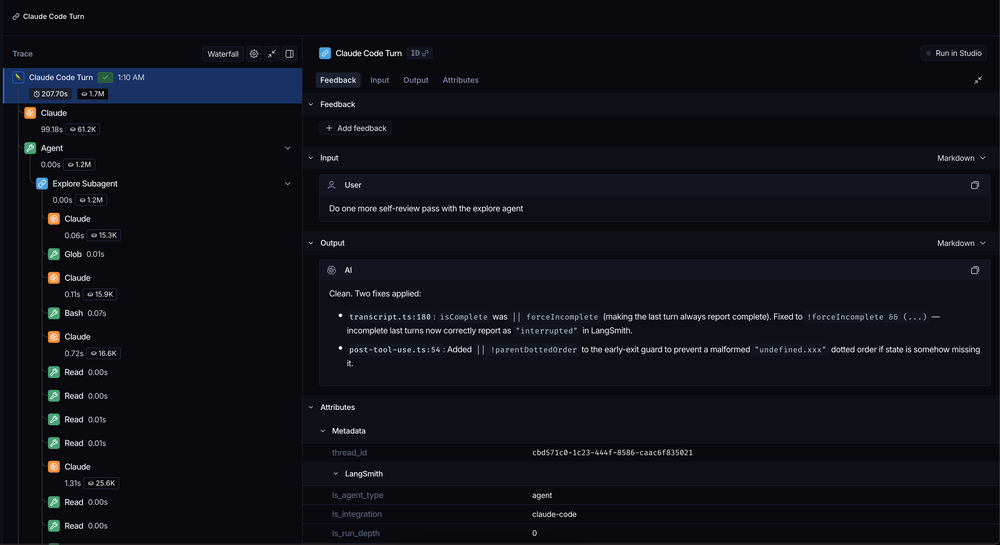

# LangSmith Tracing Plugin for Claude Code

A Claude Code plugin that traces conversations, tool calls, subagent executions, and context compaction to [LangSmith](https://smith.langchain.com).



## Prerequisites

- [Node.js](https://nodejs.org/) v18+ (hooks run via `node`)

## Installation

### As a Claude Code plugin

From within Claude Code, run:

```
/plugin marketplace add langchain-ai/langsmith-claude-code-plugins
/plugin install langsmith-tracing@langsmith-claude-code-plugins
```

### From source (development)

```bash
pnpm install
pnpm build
claude --plugin-dir /path/to/langsmith-claude-code-plugins
```

### Setting environment variables

**Option 1: Claude Code settings file (recommended)**

Add to `~/.claude/settings.json`:

```json
{
  "env": {
    "TRACE_TO_LANGSMITH": "true",
    "CC_LANGSMITH_API_KEY": "lsv2_pt_...",
    "CC_LANGSMITH_PROJECT": "my-project"
  }
}
```

**Option 2: Export to shell**

Add to your `~/.zshrc`, `~/.bashrc`, or `~/.bash_profile`:

```bash
export TRACE_TO_LANGSMITH="true"
export CC_LANGSMITH_API_KEY="lsv2_pt_..."
export CC_LANGSMITH_PROJECT="my-project"
```

### Getting your LangSmith API key

1. Go to [smith.langchain.com](https://smith.langchain.com)
2. Sign in or create an account
3. Navigate to **Settings** → **API Keys**
4. Click **Create API Key**
5. Copy the key (starts with `lsv2_pt_...`)

## What gets traced

Each LLM run includes:

- **Inputs**: accumulated conversation messages
- **Outputs**: assistant response content
- **Metadata**: `ls_provider: "anthropic"`, `ls_model_name`, `ls_invocation_params` (model, stop reason), token usage

Tool runs include the tool name, inputs, and output content.

Interrupted turns (where the user cancels mid-response) are marked with status `"interrupted"` in LangSmith.

## Environment variables

The plugin respects the following environment variables:

| Variable                           | Required | Default                           | Description                                                          |
| ---------------------------------- | -------- | --------------------------------- | -------------------------------------------------------------------- |
| `TRACE_TO_LANGSMITH`               | Yes      | —                                 | Set to `"true"` to enable tracing                                    |
| `CC_LANGSMITH_API_KEY`             | Yes      | —                                 | LangSmith API key (falls back to `LANGSMITH_API_KEY`)                |
| `CC_LANGSMITH_PROJECT`             | No       | `"claude-code"`                   | LangSmith project name                                               |
| `LANGSMITH_ENDPOINT`               | No       | `https://api.smith.langchain.com` | LangSmith API base URL                                               |
| `CC_LANGSMITH_DEBUG`               | No       | `"false"`                         | Enable debug logging                                                 |
| `CC_LANGSMITH_PARENT_DOTTED_ORDER` | No       | —                                 | Dotted-order of an existing run to nest all Claude Code traces under |

## Nesting traces under an existing run

Set `CC_LANGSMITH_PARENT_DOTTED_ORDER` to nest all Claude Code traces as children of an existing LangSmith run. This is useful when Claude Code is invoked programmatically as part of a larger traced workflow.

**Python**

```python
import subprocess
from langsmith import traceable, get_current_run_tree


os.environ["LANGSMITH_TRACING"] = "true"
os.environ["LANGSMITH_API_KEY"] = "..."
os.environ["LANGSMITH_PROJECT"] = "claude-code"

@traceable
def run_claude(prompt: str):
    run_tree = get_current_run_tree()
    subprocess.run(
        ["claude", "-p", prompt],
        env={
            **os.environ,
            "TRACE_TO_LANGSMITH": "true",
            "CC_LANGSMITH_API_KEY": "...",
            "CC_LANGSMITH_PROJECT": "claude-code",
            "CC_LANGSMITH_PARENT_DOTTED_ORDER": run_tree.dotted_order,
        },
    )
```

**TypeScript**

```ts
import { traceable, getCurrentRunTree } from "langsmith/traceable";
import { execSync } from "node:child_process";

process.env.LANGSMITH_TRACING = "true";
process.env.LANGSMITH_API_KEY = "...";
process.env.LANGSMITH_PROJECT = "claude-code";

const runClaude = traceable(
  async (prompt: string) => {
    const runTree = getCurrentRunTree();
    const pluginDir = new URL(".", import.meta.url).pathname;
    const res = execSync(`claude -p "${prompt}" --plugin-dir '${pluginDir}'`, {
      env: {
        ...process.env,
        TRACE_TO_LANGSMITH: "true",
        CC_LANGSMITH_API_KEY: "...",
        CC_LANGSMITH_PROJECT: "claude-code",
        CC_LANGSMITH_PARENT_DOTTED_ORDER: runTree.dotted_order,
      },
    });
    return res.toString();
  },
  { name: "run_claude" },
);
```

The resulting trace hierarchy looks like:

```
Your outer run (chain)
└── Claude Code Turn (chain)
    ├── Claude (llm)
    ├── Read (tool)
    └── Claude (llm)
```

## Known limitations

Currently, subagents are only traced upon completion. This means if you interrupt a conversation turn during a subagent run,
the subagent runs will not be traced.

## Development

```bash
pnpm install
pnpm dev         # Watch mode — recompiles on changes
pnpm test        # Run tests
pnpm build       # Production build
```

After making changes, run `pnpm build` and send a new message in Claude Code to pick up the updated hooks.

## License

MIT
