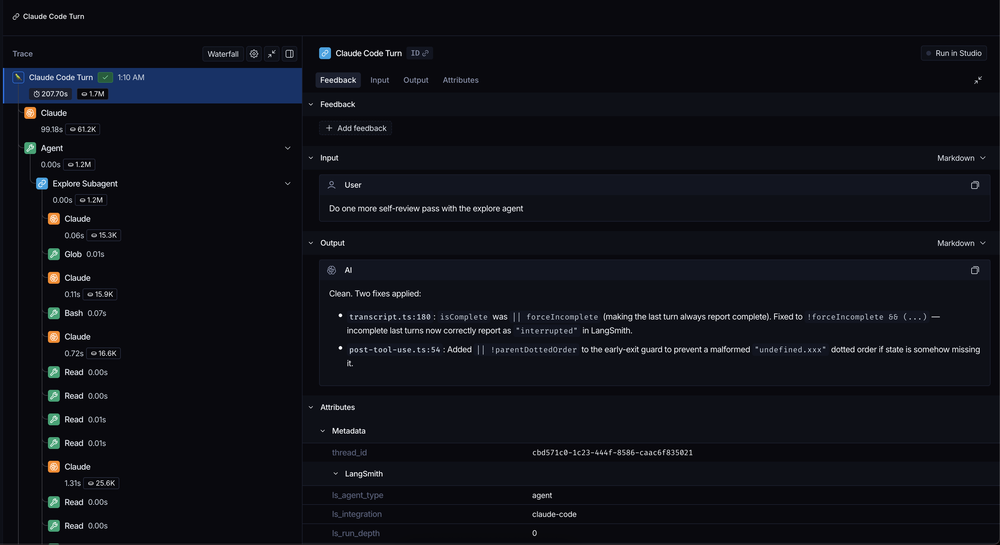

# LangSmith Tracing Plugin for Claude Code

A Claude Code plugin that traces conversations, tool calls, subagent executions, and context compaction to [LangSmith](https://smith.langchain.com).

**Setting up the LangSmith Gateway?** Start with the required [LangSmith CLI installation and browser login](#langsmith-cli-prerequisite), then install and enable the separate `langsmith-gateway` plugin. The tracing plugin documented below does **not** require the LangSmith CLI and is optional when using the gateway.



## Prerequisites

- [Node.js](https://nodejs.org/) v18+

## Installation

Every option below installs the same tracing integration. Only the delivery
differs. The plugin runs on the Node on your PATH and the marketplace manages
it. The standalone binary carries its own Node and you manage it. You are
picking an install method, not a different product.

### As a Claude Code plugin

From within Claude Code, run:

```
/plugin marketplace add langchain-ai/langsmith-claude-code-plugins
/plugin install langsmith-tracing@langsmith-claude-code-plugins
/reload-plugins
```

To update, refresh the marketplace from within Claude Code:

```
/plugin marketplace update langsmith-claude-code-plugins
```

then move the install onto the new version from your shell:

```bash
claude plugin update langsmith-tracing@langsmith-claude-code-plugins
```

and restart Claude Code.

The marketplace update on its own only refreshes the catalog clone. Your
install stays pinned to the version directory it was installed from, so the
hooks keep running the old bundle until `claude plugin update` moves it.

To skip both steps next time, run `/plugin`, open **Marketplaces** →
`langsmith-claude-code-plugins` and choose **Enable auto-update**. Third-party
marketplaces have it off by default; enabling it updates the marketplace and
its installed plugins together.

### As a standalone binary (beta, macOS arm64)

The same integration as the plugin, delivered as one file. It carries its own
Node runtime so it needs no Node on your PATH. You install and update it
yourself. The plugin is the supported path. This binary is the beta we are
trialling and macOS arm64 is the only build.

The plugin stops tracing while the binary is installed and registered as a hook.

1. Run the installer:

   ```bash
   curl -LsSf https://langch.in/claude-tracing | bash -s -- --beta
   ```

   `--beta` takes the newest prerelease. Drop it once a stable release carries
   the binary. The plain command takes the newest stable release and never a
   prerelease, so it fails while a prerelease is the only published build.

   The installer checks the download against the SHA-256 the release publishes.
   It puts the binary at `~/.langsmith/langsmith-claude-code-tracing` and adds
   the tracing hooks to `~/.claude/settings.json`. Run it with `--help` for
   version pinning and the other options.

2. Set `enabled`, `api_key` and `project` in `~/.claude/langsmith.json`.
   `enabled` is false by default, so without this the hooks run and trace
   nothing:

   ```json
   { "enabled": true, "api_key": "lsv2_pt_...", "project": "my-project" }
   ```

3. Restart Claude Code.

The binary never updates itself. Run
`~/.langsmith/langsmith-claude-code-tracing --update` for a newer release.

To download a release asset by hand instead: `chmod +x` it, then run it with
`--install`. The binary is signed and notarized, so macOS clears it after one
online Gatekeeper check.

### As a Claude Cowork plugin

Claude Cowork runs Claude Code in a sandboxed VM, thus the plugin needs to be added separately.

1. Allow network egress for `LANGSMITH_CC_ENDPOINT` (eg. `https://api.smith.langchain.com`) or for all domains
2. Add `langchain-ai/langsmith-claude-code-plugins` marketplace in Customize > Personal Plugins (+) > Create Plugin > Add Marketplace
3. Edit each of the Claude Code hooks by prepending LangSmith Claude Code environment variables to `command` of every hook. [Watch video to see step-by-step](https://github.com/user-attachments/assets/1d44b30f-e0a8-4173-b60b-97a2d1fb95c5).

https://github.com/user-attachments/assets/1d44b30f-e0a8-4173-b60b-97a2d1fb95c5

> [!IMPORTANT]
> Make sure that 'Allow network egress' is either enabled for all domains or enabled for `LANGSMITH_CC_ENDPOINT`, otherwise Cowork might freeze.

### From source (development)

```bash
pnpm install
pnpm build
claude --plugin-dir /path/to/langsmith-claude-code-plugins
```

### Setting environment variables

**Option 1: Claude Code settings file (recommended)**

Add the following to a `.claude/settings.local.json` file in your project folder or `~/.claude/settings.json` globally:

```json
{
  "env": {
    "TRACE_TO_LANGSMITH": "true",
    "CC_LANGSMITH_API_KEY": "lsv2_pt_...",
    "CC_LANGSMITH_PROJECT": "my-project"
  }
}
```

**Option 2: Export to shell**

Add to your `~/.zshrc`, `~/.bashrc`, or `~/.bash_profile`:

```bash
export TRACE_TO_LANGSMITH="true"
export CC_LANGSMITH_API_KEY="lsv2_pt_..."
export CC_LANGSMITH_PROJECT="my-project"
```

### Getting your LangSmith API key

1. Go to [smith.langchain.com](https://smith.langchain.com)
2. Sign in or create an account
3. Navigate to **Settings** → **API Keys**
4. Click **Create API Key**
5. Copy the key (starts with `lsv2_pt_...`)

## What gets traced

With full tracing (the default), each LLM run includes:

- **Inputs**: accumulated conversation messages
- **Outputs**: assistant response content
- **Metadata**: `ls_provider: "anthropic"`, `ls_model_name`, `ls_invocation_params` (model, plus `effort`/`service_tier` when the transcript records them), token usage

In full mode, all runs (LLM, tool, turn, subagent) automatically include identity metadata so you can attribute traces in LangSmith:

- `anthropic_user_id` — read from the `userID` field in `~/.claude.json` (the Claude Code installation's stable hashed user ID). Omitted if the file is missing or unreadable.
- `local_username` — the local OS username from `os.userInfo()`.

To override either field, supply your own value via `CC_LANGSMITH_METADATA` — user-supplied keys always win.

Tool runs include the tool name, inputs, and output content. Skill tool runs additionally set `ls_skill_name` — the invoked skill's name, read from the tool's `skill` input — so per-skill usage is queryable in run stats.

Interrupted turns (where the user cancels mid-response) are marked with status `"interrupted"` in LangSmith.

## Opening the current session in LangSmith

Run `/langsmith-tracing:trace` to get a link to this conversation's trace. It does
not start a model turn or change any settings. When you trace to several projects,
you get one labelled link per project.

- A new thread is empty until a traced prompt finishes uploading.
- Changing projects does not move older traces.
- These are not public share links; recipients need access to the project.
- If the lookup fails, search LangSmith for the session ID it prints.

## Muting a thread

Muting is off by default unless configured below. With tracing enabled, use these argument-free plugin commands:

- `/langsmith-tracing:mute` — omit this thread's input/output content and unsafe metadata.
- `/langsmith-tracing:unmute` — restore full tracing for subsequent turns.

Claude Code namespaces plugin commands; neither command accepts `on`, `off`, or `status`. Run `/reload-plugins` or restart Claude Code after installing or changing command definitions.

Muted runs retain their normal nesting, names, timing, status, model/tool identity, and token usage. Inputs become:

```json
{
  "messages": [
    {
      "role": "user",
      "content": "[LangSmith system notice: content omitted because tracing is muted.]"
    }
  ]
}
```

Outputs use the same message content with role `assistant`. Raw errors, identity/repository attribution, arbitrary custom metadata, SDK runtime metadata, and replica metadata overrides are excluded in muted mode. Muting is independent of the secret-redaction setting below.

Preferences are sticky per thread and stored separately from transient tracing state in `langsmith_state.privacy.json` by default. The preference path replaces a trailing `.json` in the state-file path with `.privacy.json`; paths without a trailing `.json` append `.privacy.json`. Normal state cleanup does not remove them. If this preference file is unreadable or malformed, new turns use metadata-only tracing and commands refuse to overwrite it; repair the file or permissions before retrying. Deleting it removes all thread overrides and resets to the configured default (unmuted when unset).

Both commands apply **from the next turn**; the confirmation explicitly says the current turn is unchanged. A turn's mode is fixed when it starts and inherited by its subagents. In-flight work retains its mode across later commands, so unmuting never backfills full content into a previously muted run. A new turn after unmuting—including a task-notification turn—uses full tracing and may include earlier content in its context. There is no retroactive purge or content-tracking policy across turns.

Commands save only the thread preference, never change run parent selection, and are handled without a model turn. The master switch always wins: when disabled, neither full nor metadata-only runs are uploaded.

### Default mute configuration

To start threads in metadata-only mode without running a command in each thread, set:

```bash
export CC_LANGSMITH_DEFAULT_MUTED="true"
# Use "false" to return to the unmuted default.
```

Or edit project `.claude/langsmith.json`, project-root `langsmith-plugins.json`, user `~/.claude/langsmith.json`, or home-root `~/.langsmith-plugins.json`:

```json
{
  "enabled": true,
  "defaultMuted": true
}
```

Set `defaultMuted` to the JSON boolean `false` to default to full content. You may omit `enabled` to inherit the master switch from a lower-priority source. Credentials remain separate and are still required.

For **all shared fields**, precedence is **environment > `cwd/.claude/langsmith.json` > `cwd/langsmith-plugins.json` > `~/.claude/langsmith.json` > `~/.langsmith-plugins.json` > defaults**. Resolution is per field: an `enabled`-only file does not hide a lower-priority `defaultMuted`, and vice versa. Both project paths use the hook payload's resolved `cwd` (or the process working directory when omitted), not the plugin installation directory; no ancestor directories are searched. All four files support the full shared JSON contract below. A missing field falls through. Invalid present `defaultMuted` values restrict that source to muted, but a higher-priority field can override it. Environment values `true`/`false` are case-insensitive, without whitespace trimming; any other present value, including an empty string, conservatively means muted. An unset environment variable contributes no override; the final default is unmuted.

This default applies only when a thread has **no explicit saved mute/unmute override**. A saved unmute wins even over default mute; a saved mute survives default unmute. Config changes affect the next turn of threads without overrides, including task-notification turns. Existing turn/tool/compaction/subagent launch snapshots remain unchanged. Recovery paths without snapshots use the same thread preference and configured default. Config lookup never creates or modifies the privacy preference file, and commands only save an explicit thread override—not a global default.

The privacy file stores only explicit thread overrides, using the strict schema `{ "threads": { "thread-id": "metadata" } }`; each mode must be `"full"` or `"metadata"`, and no other top-level fields are allowed. Configuration alone owns the fallback default. A missing privacy file means no overrides and is not created by reads.

### Master tracing configuration

Claude Code resolves the first applicable setting below; credentials are still required to upload.

| Priority | Setting                                   | Behavior                                                                                                                                     |
| -------- | ----------------------------------------- | -------------------------------------------------------------------------------------------------------------------------------------------- |
| 1        | `TRACE_TO_LANGSMITH`                      | When present, case-insensitive `true` enables; any other value (including empty or whitespace-padded values) disables. Overrides every file. |
| 2        | Project `cwd/.claude/langsmith.json`      | `enabled` overrides lower file sources.                                                                                                      |
| 3        | Project-root `cwd/langsmith-plugins.json` | Used when project `.claude` omits `enabled`.                                                                                                 |
| 4        | User `~/.claude/langsmith.json`           | Used when both project files omit `enabled`.                                                                                                 |
| 5        | Home-root `~/.langsmith-plugins.json`     | Baseline when higher sources omit `enabled`.                                                                                                 |
| 6        | No setting                                | Off.                                                                                                                                         |

At each priority, a missing file or field falls through; an invalid present `enabled` contributes `false`. Malformed/non-object JSON or unreadable config restricts that source to `enabled:false, defaultMuted:true`; it is not a global veto. Higher-priority fields, including environment values, still win independently. **`TRACE_TO_LANGSMITH=true` overrides file `enabled:false`.** To disable tracing regardless of files, set `TRACE_TO_LANGSMITH=false`. A thread unmute override never enables tracing when the resolved master switch is off.

## Shared `langsmith-plugins.json` contract

> **Security: trust repository tracing configuration before using this plugin.** Project `langsmith-plugins.json` and `.claude/langsmith.json` can enable tracing, choose upload endpoints and replicas, supply credentials, and disable secret redaction. A malicious configuration can send conversation messages, file contents, and tool inputs/outputs to a third party. Review these files before using the plugin in an unfamiliar repository. Also review `.claude/settings.json` and `.claude/settings.local.json`: their `env` settings can change the plugin's behavior too. Secret redaction is not a guarantee that uploaded content is safe to share. To prevent this plugin from uploading, disable it or ensure its effective `TRACE_TO_LANGSMITH` is `false`; a file-level `enabled:false` does not override an environment setting of `true`.

Use `langsmith-plugins.json` in the project root and `~/.langsmith-plugins.json` for user defaults shared across coding-tool plugins. Claude-specific overrides live in project `.claude/langsmith.json` and user `~/.claude/langsmith.json`. These files configure the plugins, not your application's LangSmith tracing.

All four paths use the same dependency-free parser (`src/shared-config.ts`). Files are read only at `cwd/.claude/langsmith.json`, `cwd/langsmith-plugins.json`, `~/.claude/langsmith.json`, and `~/.langsmith-plugins.json`; there is no ancestor search. Readable symlinks to regular files are supported. Directories, devices, FIFOs, dangling symlinks, unreadable files, malformed JSON, and non-object JSON restrict that source to `enabled:false, defaultMuted:true`. Only a truly absent entry is ignored.

| Exact JSON field     | Type / default                                        | Environment source                               |
| -------------------- | ----------------------------------------------------- | ------------------------------------------------ |
| `enabled`            | boolean / `false`                                     | `TRACE_TO_LANGSMITH`                             |
| `defaultMuted`       | boolean / `false`                                     | `CC_LANGSMITH_DEFAULT_MUTED`                     |
| `api_key`            | string / `""`                                         | `CC_LANGSMITH_API_KEY`, then `LANGSMITH_API_KEY` |
| `api_url`            | string / `https://api.smith.langchain.com`            | `LANGSMITH_ENDPOINT`                             |
| `project`            | string / `claude-code`                                | `CC_LANGSMITH_PROJECT`                           |
| `replicas`           | array of objects / absent                             | `CC_LANGSMITH_RUNS_ENDPOINTS`                    |
| `metadata`           | JSON object / absent                                  | `CC_LANGSMITH_METADATA`                          |
| `redact`             | boolean / `true`                                      | `CC_LANGSMITH_REDACT`                            |
| `redact_extra_rules` | array of `{pattern:string, replace?:string}` / absent | `CC_LANGSMITH_REDACT_EXTRA`                      |

**All shared fields use environment > `cwd/.claude/langsmith.json` > `cwd/langsmith-plugins.json` > `~/.claude/langsmith.json` > `~/.langsmith-plugins.json` > defaults**, independently for each field. Strings, including empty strings and whitespace, are accepted unchanged. Arrays replace rather than concatenate; `[]` explicitly selects no replicas/rules. Metadata shallow-merges per key from defaults → home root → user `.claude` → cwd root → project `.claude` → env: nested values replace, and `{}` does not clear inherited keys. `__proto__` is treated as own data, not a prototype mutation. File metadata is treated as untrusted user metadata by privacy filtering.

An invalid present `enabled` restricts only that field to `false`; an invalid present `defaultMuted` restricts only that field to `true`. **Any other recognized field with an invalid value invalidates the entire common file:** discard all its ordinary fields and restrict both switches. Ordinary values can still fall back to lower sources; higher-priority switch fields still override the restrictions (e.g. environment can override either switch from any invalid file without overriding the other switch). Unknown keys are ignored, including malformed harness extensions; adapters can access the decoded raw object separately. Diagnostics never include file contents.

Replica file entries use `api_url`, `api_key`, `project` (optional strings) and `updates` (optional JSON object, preserved). SDK aliases `apiUrl`, `apiKey`, `projectName` are accepted **only inside replica objects**. An own canonical key always wins, even if empty or invalid: `api_key:null` invalidates the common file even alongside a valid `apiKey`. Unknown replica/rule keys are stripped; `{}` is a valid replica. File tuple entries are invalid. `CC_LANGSMITH_RUNS_ENDPOINTS` supports SDK replica objects and the supported SDK tuple format. Rule patterns must compile as global regular expressions; any invalid file rule invalidates the common file. Malformed environment rules are skipped; an explicit environment `[]` overrides file rules.

```json
{
  "enabled": true,
  "defaultMuted": true,
  "project": "my-project",
  "metadata": { "team": "platform" },
  "redact": true,
  "redact_extra_rules": [{ "pattern": "ACME-[A-Z0-9]+", "replace": "[REDACTED]" }],
  "replicas": [
    { "api_url": "https://api.smith.langchain.com", "api_key": "your-key", "project": "audit" }
  ]
}
```

Credentials may come from files, including replica-only credentials, but never enable tracing by themselves: all uploads require the master switch to be enabled. `redact:false` never bypasses muted content/provenance filtering. Keep credential-bearing files out of version control.

## Secret redaction

By default, the plugin strips common secrets — provider API keys, JWTs, PEM blocks, and structural `NAME=value`, `Authorization`, and URL-credential shapes — from run inputs, outputs, and metadata **before they are uploaded** to LangSmith. Identity/attribution metadata (`anthropic_user_id`, `local_username`) is unaffected; only secret _values_ are redacted.

- Set `CC_LANGSMITH_REDACT` to a falsy value (`false`, `0`, `no`, or `off`) to turn redaction off.
- Set `CC_LANGSMITH_REDACT_EXTRA` to a JSON array of `{ "pattern": "...", "replace": "..." }` rules to redact additional custom patterns. `pattern` is a regular-expression string; `replace` (optional) is the replacement text. Malformed rules are skipped with a logged error.

```json
{
  "env": {
    "CC_LANGSMITH_REDACT_EXTRA": "[{\"pattern\":\"ACME-[A-Z0-9]{16}\",\"replace\":\"[REDACTED_ACME_KEY]\"}]"
  }
}
```

## Environment variables

The plugin respects the following environment variables:

| Variable                           | Required | Default                           | Description                                                                                                                                      |
| ---------------------------------- | -------- | --------------------------------- | ------------------------------------------------------------------------------------------------------------------------------------------------ |
| `TRACE_TO_LANGSMITH`               | No       | File config, then off             | Overrides every file when present; `"true"` enables, any other value disables.                                                                   |
| `CC_LANGSMITH_DEFAULT_MUTED`       | No       | File config, then `false`         | Overrides file defaults when present; metadata-only tracing for threads without overrides. Case-insensitive `true`/`false`; invalid values mute. |
| `CC_LANGSMITH_API_KEY`             | No\*     | —                                 | LangSmith API key (falls back to `LANGSMITH_API_KEY`). \*Required unless `CC_LANGSMITH_RUNS_ENDPOINTS` is set.                                   |
| `CC_LANGSMITH_PROJECT`             | No       | `"claude-code"`                   | LangSmith project name                                                                                                                           |
| `LANGSMITH_ENDPOINT`               | No       | `https://api.smith.langchain.com` | LangSmith API base URL                                                                                                                           |
| `CC_LANGSMITH_DEBUG`               | No       | `"false"`                         | Enable debug logging                                                                                                                             |
| `CC_LANGSMITH_PARENT_DOTTED_ORDER` | No       | —                                 | Dotted-order of an existing run to nest all Claude Code traces under                                                                             |
| `CC_LANGSMITH_METADATA`            | No       | —                                 | JSON object of custom metadata to attach to all runs (e.g. PR URL, author)                                                                       |
| `CC_LANGSMITH_RUNS_ENDPOINTS`      | No       | —                                 | JSON array of replica destinations for multi-project tracing                                                                                     |
| `CC_LANGSMITH_REDACT`              | No       | `"true"`                          | Set to a falsy value (`false`/`0`/`no`/`off`) to disable client-side secret redaction before upload                                              |
| `CC_LANGSMITH_REDACT_EXTRA`        | No       | —                                 | JSON array of `{ pattern, replace }` custom redaction rules, applied alongside the built-in secret patterns                                      |

## Usage with GitHub Actions

You can use this plugin with [`anthropics/claude-code-action`](https://github.com/anthropics/claude-code-action) to trace Claude Code runs in CI. Add the following to your workflow:

```yaml
- uses: anthropics/claude-code-action@v1
  env:
    TRACE_TO_LANGSMITH: "true"
    CC_LANGSMITH_API_KEY: ${{ secrets.LANGSMITH_API_KEY }}
    CC_LANGSMITH_PROJECT: "my-project"
    CC_LANGSMITH_METADATA: |
      {
        "pr_url": "${{ github.event.pull_request.html_url || '' }}",
        "pr_number": "${{ github.event.pull_request.number || '' }}",
        "pr_author": "${{ github.event.pull_request.user.login || '' }}",
        "repository": "${{ github.repository }}",
        "commit_sha": "${{ github.sha }}",
        "trigger": "${{ github.event_name }}"
      }
  with:
    anthropic_api_key: ${{ secrets.ANTHROPIC_API_KEY }}
    github_token: ${{ secrets.GITHUB_TOKEN }}
    plugin_marketplaces: |
      https://github.com/langchain-ai/langsmith-claude-code-plugins.git
    plugins: |
      langsmith-tracing@langsmith-claude-code-plugins
    prompt: |
      Your prompt here
```

Make sure to add `LANGSMITH_API_KEY` and `ANTHROPIC_API_KEY` as [repository secrets](https://docs.github.com/en/actions/security-for-github-actions/security-guides/using-secrets-in-github-actions).

See [`.github/workflows/claude-code-review.yml`](.github/workflows/claude-code-review.yml) for a full working example.

## Nesting traces under an existing run

Set `CC_LANGSMITH_PARENT_DOTTED_ORDER` to nest all Claude Code traces as children of an existing LangSmith run. This is useful when Claude Code is invoked programmatically as part of a larger traced workflow.

**Python**

```python
import subprocess
from langsmith import traceable, get_current_run_tree


os.environ["LANGSMITH_TRACING"] = "true"
os.environ["LANGSMITH_API_KEY"] = "..."
os.environ["LANGSMITH_PROJECT"] = "claude-code"

@traceable
def run_claude(prompt: str):
    run_tree = get_current_run_tree()
    subprocess.run(
        ["claude", "-p", prompt],
        env={
            **os.environ,
            "TRACE_TO_LANGSMITH": "true",
            "CC_LANGSMITH_API_KEY": "...",
            "CC_LANGSMITH_PROJECT": "claude-code",
            "CC_LANGSMITH_PARENT_DOTTED_ORDER": run_tree.dotted_order,
        },
    )
```

**TypeScript**

```ts
import { traceable, getCurrentRunTree } from "langsmith/traceable";
import { execSync } from "node:child_process";

process.env.LANGSMITH_TRACING = "true";
process.env.LANGSMITH_API_KEY = "...";
process.env.LANGSMITH_PROJECT = "claude-code";

const runClaude = traceable(
  async (prompt: string) => {
    const runTree = getCurrentRunTree();
    const pluginDir = new URL(".", import.meta.url).pathname;
    const res = execSync(`claude -p "${prompt}" --plugin-dir '${pluginDir}'`, {
      env: {
        ...process.env,
        TRACE_TO_LANGSMITH: "true",
        CC_LANGSMITH_API_KEY: "...",
        CC_LANGSMITH_PROJECT: "claude-code",
        CC_LANGSMITH_PARENT_DOTTED_ORDER: runTree.dotted_order,
      },
    });
    return res.toString();
  },
  { name: "run_claude" },
);
```

The resulting trace hierarchy looks like:

```
Your outer run (chain)
└── Claude Code Turn (chain)
    ├── Claude (llm)
    ├── Read (tool)
    └── Claude (llm)
```

## Tracing to multiple destinations (Replicas)

You can trace to multiple LangSmith projects or workspaces simultaneously using the `CC_LANGSMITH_RUNS_ENDPOINTS` environment variable. This is useful for:

- Sending traces to both a production and staging project
- Tracing to multiple workspaces with different API keys
- Adding extra metadata to specific replica destinations

For more information on replicas, see the [LangSmith documentation](https://docs.langchain.com/langsmith/log-traces-to-project).

### Configuration

Set `CC_LANGSMITH_RUNS_ENDPOINTS` to a JSON array of replica configurations. This will override other client settings.

**Option 1: Claude Code settings file (recommended)**

In your local `.claude/settings.local.json` or global `~/.claude/settings.json`:

```json
{
  "env": {
    "TRACE_TO_LANGSMITH": "true",
    "CC_LANGSMITH_RUNS_ENDPOINTS": "[{\"apiUrl\":\"https://api.smith.langchain.com\",\"apiKey\":\"ls__key_workspace_a\",\"projectName\":\"project-prod\"},{\"apiUrl\":\"https://api.smith.langchain.com\",\"apiKey\":\"ls__key_workspace_b\",\"projectName\":\"project-staging\",\"updates\":{\"metadata\":{\"environment\":\"staging\"}}}]"
  }
}
```

> **Tip:** To generate the escaped JSON string, use: `echo '[{"apiUrl":"...","apiKey":"...","projectName":"..."}]' | jq -cR .`

**Option 2: Shell environment variable**

Add to your `~/.zshrc`, `~/.bashrc`, or `~/.bash_profile`:

```bash
export CC_LANGSMITH_RUNS_ENDPOINTS='[{"apiUrl":"https://api.smith.langchain.com","apiKey":"ls__key_workspace_a","projectName":"project-prod"},{"apiUrl":"https://api.smith.langchain.com","apiKey":"ls__key_workspace_b","projectName":"project-staging","updates":{"metadata":{"environment":"staging"}}}]'
```

### Replica format

Each replica object supports the following fields:

| Field         | Required | Description                                                     |
| ------------- | -------- | --------------------------------------------------------------- |
| `apiUrl`      | Yes      | LangSmith API URL (typically `https://api.smith.langchain.com`) |
| `apiKey`      | Yes      | API key for the destination workspace                           |
| `projectName` | Yes      | Project name in the destination workspace                       |
| `updates`     | No       | Optional metadata/fields to override on the replicated runs     |

## Experimental langsmith-gateway plugin (separate install)

Route model requests through LangSmith independently of tracing. The default is
**OAuth-only gateway authentication**, using gateway-managed provider keys and
provider billing. Native Claude credentials are forwarded only with explicit opt-in.
**The gateway receives unredacted conversation/tool content**; tracing settings,
mute, and redaction do not filter it. Review the [operational and security reference](./LOCAL_PROXY.md)
before enabling.

### LangSmith CLI prerequisite

**Install and authenticate the LangSmith CLI before installing or enabling the gateway plugin.**
The gateway requires macOS/Linux, Node.js 20+, and Claude Code and `langsmith` on PATH.
These requirements are for the gateway, not the tracing-only installation above.

In your terminal, install the [LangSmith CLI](https://docs.langchain.com/langsmith/langsmith-cli)
if needed:

```sh
curl -fsSL https://cli.langsmith.com/install.sh | sh
```

Follow the installer's PATH instructions, then open a new terminal if needed so
`langsmith` is available to both your shell and Claude Code. For a new production
configuration, log in using the CLI’s normal selected/default profile:

```sh
langsmith auth login
```

Complete the browser login using ordinary short-lived OAuth credentials, not the
CLI's static-token gateway setup flow. Setup does not check login; authentication
is checked on first model use. For an existing or alternate profile, follow the
[profile and issuer guidance](./LOCAL_PROXY.md#alternate-api-and-gateway-hosts).
Without `--profile`, new gateway setups defer to the CLI’s persisted `current_profile`
(or `default` when none is selected). The sanitized token subprocess does not inherit
`LANGSMITH_PROFILE` or other CLI environment overrides; use setup `--profile name`
if you need to pin an environment-only selection.

### Install and enable the gateway in Claude Code

1. **Install at user scope**, inside Claude Code, so hooks run in all projects:

   ```text
   /plugin marketplace add langchain-ai/langsmith-claude-code-plugins
   /plugin install langsmith-gateway@langsmith-claude-code-plugins --scope user
   /reload-plugins
   ```

   `langsmith-tracing` is a separate, optional install.

2. **Enable gateway routing globally:**

   ```text
   /langsmith-gateway:setup --scope global
   ```

   This saves routing in `~/.claude/settings.json` and starts the local daemon.
   For only the current project, use `/langsmith-gateway:setup --scope project`;
   it writes `.claude/settings.local.json`. Keep these credential-bearing files
   private, untracked, and git-ignored; never commit credentials.

   New configs use API `https://api.smith.langchain.com`, gateway
   `https://gateway.smith.langchain.com`, the CLI default/current profile, and port `52507`.
   Existing configs retain their CLI/profile/port and endpoints. All scopes share
   one daemon and must use the same options. If the CLI is not found, check PATH
   and retry setup.

3. **Continue using Claude Code.** Default Claude models need no changes. If routing
   does not update, see [troubleshooting](./LOCAL_PROXY.md#safety-and-troubleshooting).

Gateway session-start and prompt hooks start the daemon whenever the private proxy
config is enabled, independently of routing settings (including managed-only routing).
They do not read user/project routing or interpret Claude managed policy/precedence.
Setup and disable still modify only the selected user/project settings files, not
managed settings; disabled private config is never implicitly re-enabled by hooks.

To undo routing, run `/langsmith-gateway:disable --scope global` or `--scope project`.
**Restart affected Claude sessions to stop using the proxy.** Global routing still
applies after disabling a project's local scope. Disable every active scope before
uninstalling; see [disable and re-enable details](./LOCAL_PROXY.md#session-recovery-and-disabling).

### Read-only gateway status

```text
/langsmith-gateway:status
```

Reports saved global/current-project routing, shared configuration, and local
health without changing anything. Optional `--scope global|project` selects one
routing target. This is not a check of live session routing or upstream authentication.

### Optional Claude subscription credential forwarding

```text
/langsmith-gateway:setup --scope project --use-claude-subscription
/langsmith-gateway:setup --scope project
```

The first command opts in; the second turns forwarding off. Every explicit setup
without the flag saves `false`; hooks retain the saved choice between sessions.
Opt-in requires native Claude login and sends native credentials for built-in
Anthropic destinations, including gateway fallback legs; provider eligibility and
billing terms still apply. Both modes require LangSmith CLI login.

To switch modes, run setup on the configured scope after disabling all other active
scopes. Expect brief downtime. See [mode switching and recovery](./LOCAL_PROXY.md#optional-subscription-forwarding-and-mode-switching).

### Alternate API and gateway hosts

Use paired `--api-url` / `--gateway-url` flags and a matching OAuth profile.
You can optionally specify an LangSmith auth profile with `--profile name`
**`--api-url` does not change a saved OAuth issuer.** Before changing endpoints,
profile, CLI, or port, disable all scopes and follow the
[switching-destinations procedure](./LOCAL_PROXY.md#alternate-api-and-gateway-hosts),
including session shutdown and drain before login.

For model overrides and token-counting limits, see [model details](./LOCAL_PROXY.md#consent-credentials-and-models).

## Known limitations

Currently, subagents are only traced upon completion. This means if you interrupt a conversation turn during a subagent run,
the subagent runs will not be traced.

## Development

```bash
pnpm install
pnpm test        # Run tests
pnpm build       # Regenerate tracing and experimental gateway bundles
```

After making changes, run `pnpm build`, then run:

```bash
claude --plugin-dir /path/to/langsmith-claude-code-plugins
```

and send a new message in Claude Code to pick up the updated hooks.

## License

MIT
