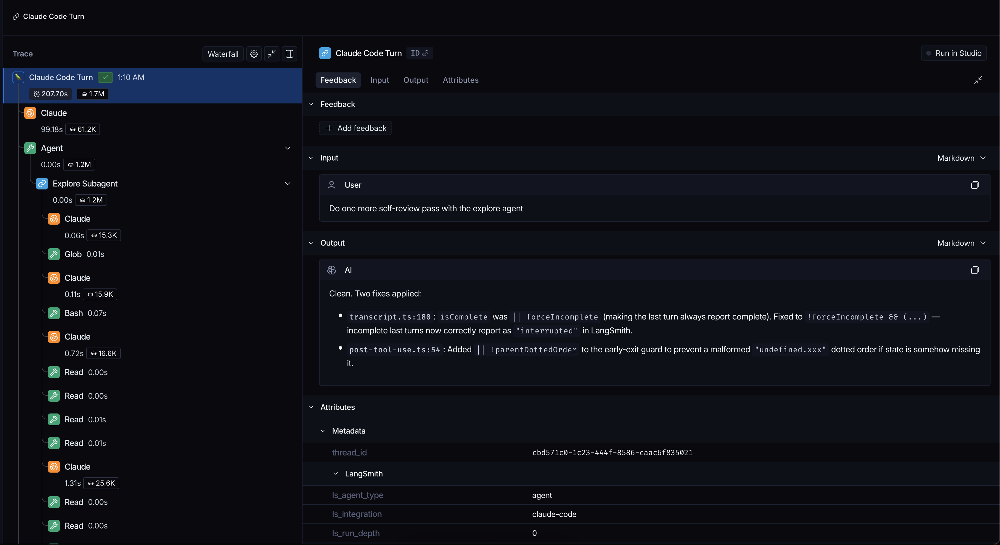

# LangSmith Tracing for Claude Code

Sends your Claude Code conversations to [LangSmith](https://smith.langchain.com) so you can read back what the agent actually did.



## What you need

- **On a Mac, nothing.** The plugin carries its own build and runs it directly.
- **Everywhere else, including Windows,** Node.js 20 or newer.
- A LangSmith account and API key.

If the carried Mac build cannot start, the plugin falls back to Node rather than dropping the trace, so Node is worth having on a Mac too.

## Install

Run these inside Claude Code:

```text
/plugin marketplace add langchain-ai/langsmith-claude-code-plugins
/plugin install langsmith-tracing@langsmith-claude-code-plugins
/reload-plugins
```

Updates are off by default for this marketplace, so turn on auto-update in `/plugin` under **Marketplaces**, or run `claude plugin update langsmith-tracing@langsmith-claude-code-plugins`. Either way the new version loads in your next session.

## Turn on tracing

Tracing is off until you give it a key and switch it on. Write both to `~/.claude/langsmith.json`:

```json
{ "enabled": true, "api_key": "lsv2_pt_...", "project": "claude-code" }
```

Get a key from [smith.langchain.com](https://smith.langchain.com) under **Settings** then **API Keys**. Send a message, then look for it in the `claude-code` project.

Settings can also live in a single project, at `<project>/.claude/langsmith.json` or `<project>/langsmith-plugins.json`, or be shared with LangSmith's other coding-tool plugins at `~/.langsmith-plugins.json`. A setting from your shell beats a project file, which beats `~/.claude/langsmith.json`, which beats the shared one.

> **Check a repository's tracing settings before you trust it.** A project file can switch tracing on, point uploads at someone else's server, supply its own credentials and turn secret redaction off, and a full trace can carry your conversation, file contents and tool results. Review these files in an unfamiliar repository, along with `.claude/settings.json` and `.claude/settings.local.json`.

## What gets traced

Each model call carries the conversation so far, the assistant's reply, and the model name, provider and token counts. Tool calls come with their inputs and outputs, and skill calls record which skill ran so you can count usage per skill. A subagent, meaning a helper Claude Code spawns to work on its own, appears nested under the turn that started it, and a turn you cancel is marked interrupted rather than dropped.

Run `/langsmith-tracing:trace` to get a link to the current conversation's trace. It does not start a model turn or change anything.

A subagent only uploads once it finishes, so cancelling one leaves its own steps out and marks the call that started it interrupted.

## Hide one conversation

To keep one conversation's content out of LangSmith, run these inside Claude Code:

```text
/langsmith-tracing:mute
/langsmith-tracing:unmute
```

Muting still records which steps ran, how long they took and how many tokens they used, but leaves out what was said. It applies from the next turn rather than the one in flight. The turn in progress keeps the setting it started with, and so does any subagent it launched, so wait for the confirmation before sending anything sensitive.

Muting changes only what reaches LangSmith. Claude Code still reads and remembers everything locally, and earlier uploads are not deleted.

To mute every conversation by default instead of one at a time, set `defaultMuted` to `true`. A conversation you muted or unmuted by hand keeps that choice regardless.

## Change a setting

Every setting has a key you can write in the config file and a variable you can set in your shell, and the shell wins. For the API key alone you may also use `LANGSMITH_API_KEY`, which `CC_LANGSMITH_API_KEY` overrides.

| Config key           | Environment variable          | Default                           | What it does                            |
| -------------------- | ----------------------------- | --------------------------------- | --------------------------------------- |
| `enabled`            | `TRACE_TO_LANGSMITH`          | `false`                           | Whether to trace at all                 |
| `api_key`            | `CC_LANGSMITH_API_KEY`        | none                              | Your LangSmith key                      |
| `project`            | `CC_LANGSMITH_PROJECT`        | `claude-code`                     | Where runs land                         |
| `api_url`            | `LANGSMITH_ENDPOINT`          | `https://api.smith.langchain.com` | Which server to send to                 |
| `defaultMuted`       | `CC_LANGSMITH_DEFAULT_MUTED`  | `false`                           | Leave content out unless told otherwise |
| `redact`             | `CC_LANGSMITH_REDACT`         | `true`                            | Strip secrets before upload             |
| `redact_extra_rules` | `CC_LANGSMITH_REDACT_EXTRA`   | none                              | Extra patterns to strip                 |
| `metadata`           | `CC_LANGSMITH_METADATA`       | none                              | Custom fields on every run              |
| `replicas`           | `CC_LANGSMITH_RUNS_ENDPOINTS` | none                              | Send the same trace somewhere else too  |

Unless you turn `redact` off, secrets are stripped before anything is uploaded, covering API keys, JWTs, PEM blocks and common `NAME=value`, `Authorization` and URL-credential shapes. That is not a guarantee that what you upload is safe to share.

## When nothing shows up

- **No runs at all.** Check the plugin is installed and enabled in `/plugin`, and that tracing is switched on. A `TRACE_TO_LANGSMITH` in your shell overrides whatever the files say.
- **Rejected key.** Make sure the key you set is still valid, and remember a key in your shell beats the one in your file.
- **Runs in the wrong place.** Change the project you send to, either in the file or in your shell.

## What leaves your machine

With tracing on, a full turn uploads your messages, tool inputs and outputs, metadata, token usage and subagent structure. A muted turn uploads the structure and placeholders instead. Keep tracing off if none of that may leave your machine.

## More

- [Running in CI, nesting under another run, and sending to several destinations](./ADVANCED.md)
- [The separate `langsmith-gateway` plugin](./LOCAL_PROXY.md), which routes model requests through LangSmith and is unrelated to tracing

## Development

```bash
pnpm install
pnpm test
pnpm build
```

Run `pnpm build`, then `claude --plugin-dir /path/to/langsmith-claude-code-plugins`, and send a new message to pick up your changes.

## License

MIT
